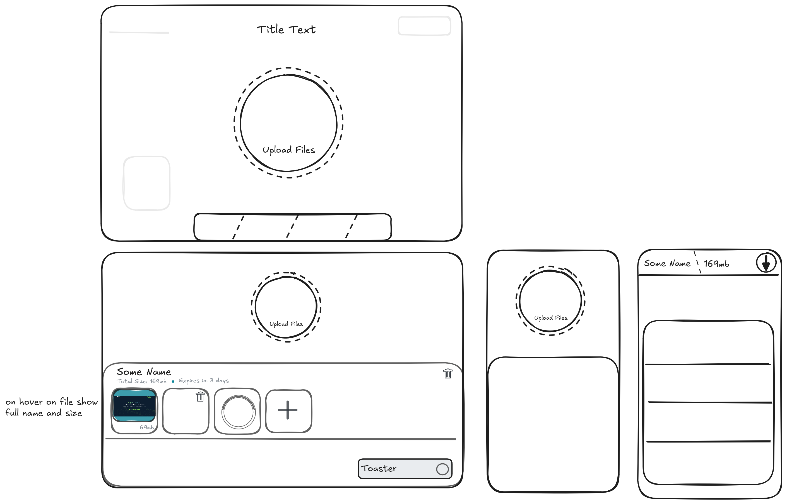
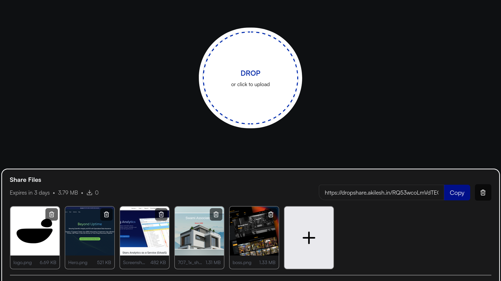

# Drop Share README


## Thanks to:

*File icons:*
https://www.untitledui.com/resources/file-icons
https://www.figma.com/community/file/1113398399853613530/40-file-type-file-extension-icon
https://github.com/dmhendricks/file-icon-vectors


https://oneuptime.com/blog/post/2026-01-27-rails-activestorage-file-uploads/view


### Application



* Ruby version
ruby -v 4.0.1
rails -v 8.1.3

* System dependencies

  libvips v8.6+
  ffmpeg v3.4+
  poppler

* Configuration

* Services (job queues, cache servers, search engines, etc.)

* Deployment instructions

* Primary colour
#000F89 - https://en.wikipedia.org/wiki/Copper_phthalocyanine
#0E1012 - https://akilesh.in


## CSS

Design system insp: https://hds.hel.fi/

base/ → global rules
layout/ → structure (grid, flex, drawer)
components/ → reusable UI pieces
pages/ → page-specific tweaks


Naming convention class-based styling 

## DB Structure
folders - koppuraikal - கோப்புறைகள்
files - koppukal - கோப்புகள்
stats

bin/rails generate model Koppurai koppu:attachment

### TODO
* remove unattached files - https://guides.rubyonrails.org/active_storage_overview.html#purging-unattached-uploads
* Serve Large files directly - https://writesoftwarewell.com/serving-large-files-rails-nginx-thruster
* Optimise rails Sqlite - https://fractaledmind.com/2024/04/15/sqlite-on-rails-the-how-and-why-of-optimal-performance/
* use import map - https://videojs.org/


## Helper commands
Rails.logger.info ("DEBUG :::: #{file_size}")


### Delte all records and asserts

**In production**
```ruby
ActiveStorage::Attachment.all.each { |attachment| attachment.purge }

# remove orphan file records
Koppu.left_joins(:koppu_attachment)
      .where(active_storage_attachments: { id: nil })
      .destroy_all

# remove empty folders
Koppurai.left_joins(:koppus)
         .where(koppus: { id: nil })
         .destroy_all
```
**In Dev**
```ruby
ActiveStorage::Attachment.delete_all
ActiveStorage::Blob.delete_all

Koppu.delete_all
Koppurai.delete_all
```
